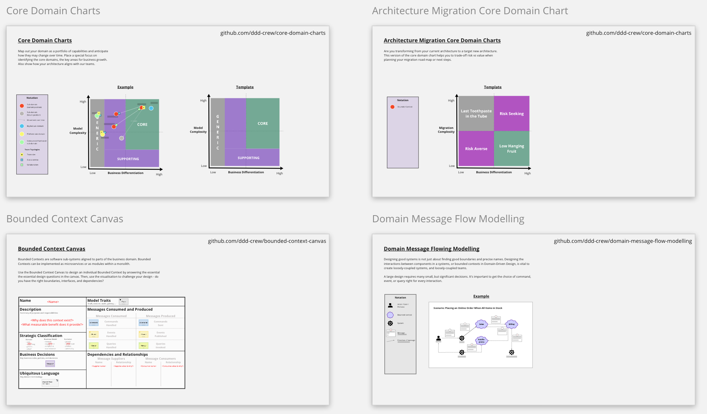

# Virtual Modelling Templates
This repo contains a collection of resources for applying DDD collaboratively in remote environments.

## Strategic DDD Miro Template

[Download the Miro backup file](resources/strategic-ddd-miro-backup.rtb)

## Context Mapping Miro Template

[Download the Miro backup file](resources/Remote-Context-Mapping-Starter-Kit.rtb)

## Instructions

1. Download the Miro backup file
2. Sign in to your Miro account
3. Restore the backup file 

## Contributions and Feedback

These tools are freely available for you to use. In addition, your feedback and ideas are welcome to improve them. 

Feel free to also send us a pull request with your examples or experience reports.

[![CC BY 4.0][cc-by-shield]][cc-by]

This work is licensed under a [Creative Commons Attribution 4.0 International
License][cc-by].

[![CC BY 4.0][cc-by-image]][cc-by]

[cc-by]: http://creativecommons.org/licenses/by/4.0/
[cc-by-image]: https://i.creativecommons.org/l/by/4.0/88x31.png
[cc-by-shield]: https://img.shields.io/badge/License-CC%20BY%204.0-lightgrey.svg